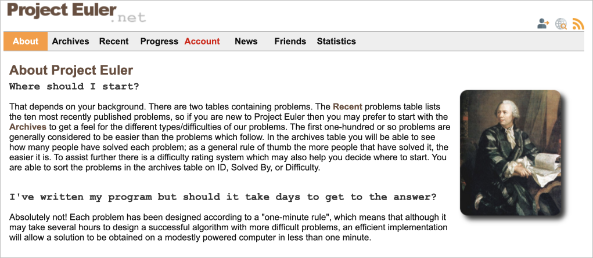

# GPT-4 can solve math problems — but not in all languages
*A few experiments making GPT-4 solve math problems in 16 different languages*

This repository includes the code used in the related article. In the article, I prompt GPT-4 in 16 different languages to solve a subset of Project Euler problems. I find that GPT-4 is much better at solving problems in certain languages (e.g. English, German, Spanish) than others (e.g. Amharic, Burmese, Farsi). 

Data included:
- `solutions.txt` from https://www.kaggle.com/datasets/dheerajmpai/projecteuler?select=Solutions.md.txt
- `problems.csv` from https://www.kaggle.com/datasets/patrickgendotti/project-euler-full-problem-set?resource=download
- `problems_df_cleaned.csv`: My cleaned version merging the solutions and problems into a single dataframe
- `project_euler_gpt4_responses.csv`: CSV containing all of GPT-4's generated responses to Project Euler questions in the different languages
- `back_trans_df.csv`': CSV containing GPT-4's responses translated back into English

